# Integrating API Connect with a 3rd Party OpenID Connect Provider (IBM blueID)

This guide supplies instructions for integrating IBM API Connect with the IBM blueID IDaaS OpenID Connect provider.

One of the limitations in using the IBM IDaaS is that there is no way to automatically create clients in the blueID system. That means, any applications registered in the API Connect developer portal must be manually registered in the blueID system as well.

Other 3rd-party OAuth/OIDC providers such as IBM's ISAM or Ping Federate have APIs which would allow synchronization of the client credentials between API Connect and the provider registry.

Sections of this guide:

1) Register an Application in the API Connect Developer Portal

2) Register a blueID Application and Client

3) Configure an API to use blueID ODIC

4) Publish and subscribe to the API Product

5) Test the API

## 1) Register an Application in the API Connect Developer Portal

1.  Log in to the API Connect Developer Portal for your desired Catalog.

1.  Select the `Apps` option from the menu bar.

1.  Click the button to `Create new App`.

1.  Give the application a title and click the `Submit` button.

    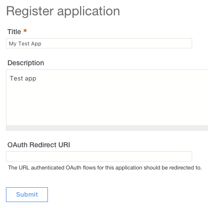

1.  Select to show the Client ID and save the value to a notepad.

    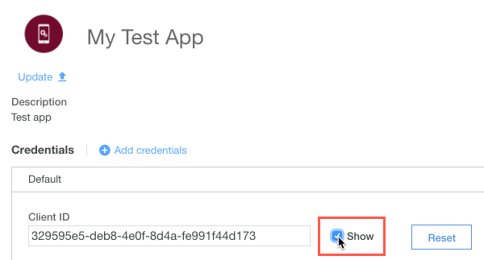

1.  Select to show the Client Secret and save the value to a notepad.

    

## 2) Register a blueID Application and Client

1.  Launch the IBM SSO Self-Service Portal:

    <https://w3.innovate.ibm.com/tools/sso/home.html>

1.  Click on the Register a blueID application link.

1.  Accept the Terms and Conditions.

1.  Fill out the Application Details form, this page includes details for the API you’re developing.

    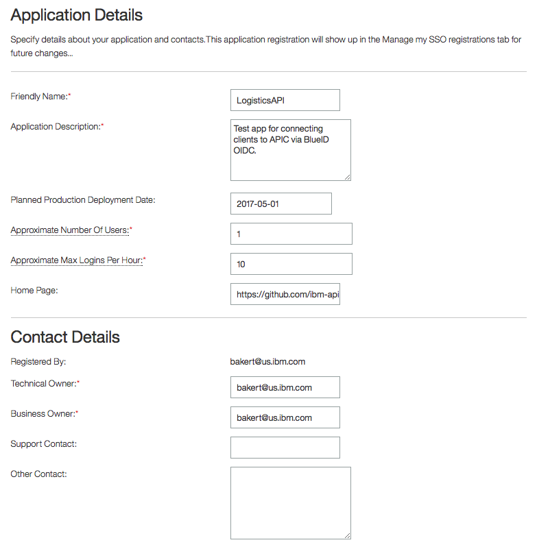

1.  Select the Pre-Production identity provider.

    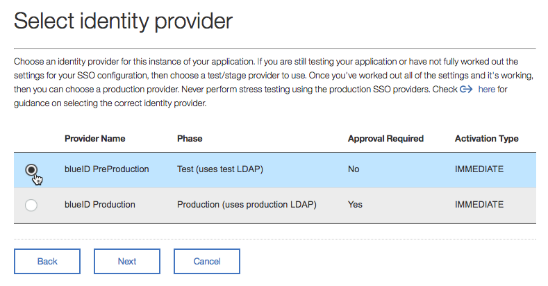

1.  Register a blueID Client Application.

1.  Provide a unique Client Name.

1.  Remove the auto-generated Client ID and Client Secret.

    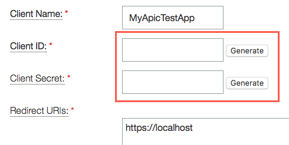

1.  Enter the Client ID and Client Secret from the Application generated by the APIC Developer Portal.

    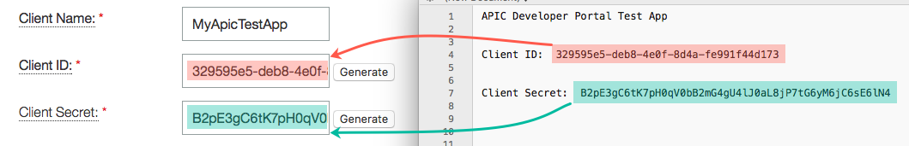

1.  Enter the following Redirect URL's:

    * https://www.getpostman.com/oauth2/callback

    * https://apic-oidc-blueid.mybluemix.net/callback

    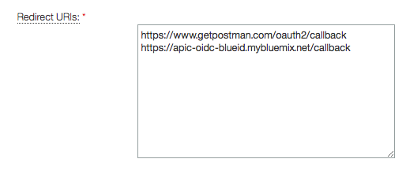

1.  Select the desired grant types.

    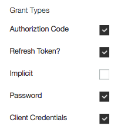

1.  Take note of the endpoints.

1.  Click the Continue button.

1.  Confirm the details, scroll to the bottom and click the Save and Continue button.

1.  You will receive an email stating that the application request was received followed a few minutes later by a second email stating that the request was successful.

## 3) Configure an API to use blueID ODIC

1.  Log in to the API Manager server and navigate to the Draft APIs section.

1.  Click the `Add +` button and chose to `Import API from a file or URL`.

    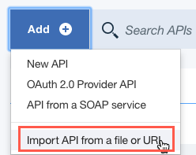

1.  Click on the `Or import from URL...` and provide the url:

    *	https://raw.githubusercontent.com/ibm-apiconnect/oidc-blueid/master/samples/logistics_1.0.0.yaml

    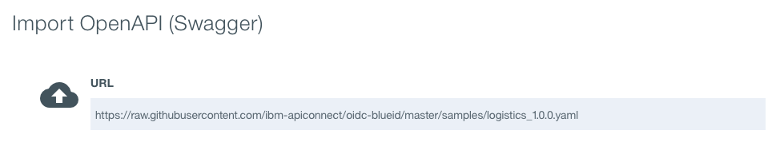

1.  Navigate to the Security Definitions section.

1.  Ensure that you have security definitions that require the Client ID and Client Secret, both are required for blueID OIDC to work.

1.  Create a new Security Definition for OAuth.

    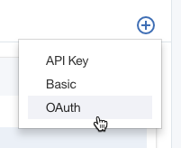

1.  Scroll down to configure the OAuth security definition.

1.  Rename the Security Definition.

1.  Select the desired grant type flow.

    **Note:** The flow selected here is for informational purposes within the developer portal. Whichever flow you decide to use must be enabled for the blueID client. To remain consistent with this guide, I suggest you use the `Access Code` flow.

1.  Enter the blueID endpoints for the `Authorization URL`, `Token URL` and `Introspection URL`.

1.  Add a new scope to the Security Definition called `openid`.

    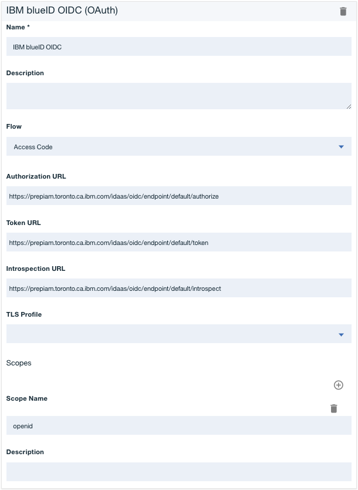

1.  Scroll down to the Security section of the API definition and ensure all three Security Definitions are selected, along with the two OAuth scopes.

    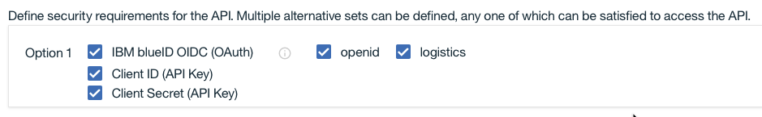

1.  Save the API definition.

## 4) Publish and subscribe to the API Product

1.  Click on the menu button for the API located in the top-right corner and chose to `Generate a default product`.

1.  Scroll down and chose the option to `Publish this product to a catalog`.

1.  Select the desired catalog from the list and click on the `Create product` button.

    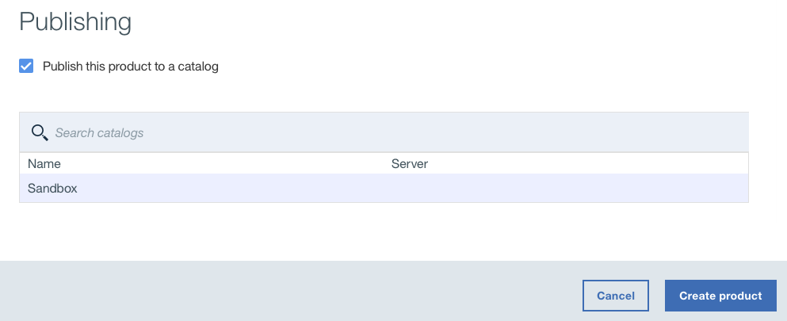

1.  Open a new browser tab and log in to the Catalog’s Developer Portal.

1.  Select the API Products tab and select your new `logistics product`.

1.  Click the Subscribe button to link your registered application to the API Product.

    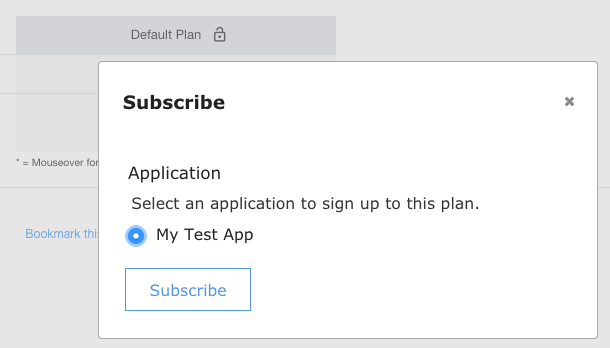

## 5) Test the API

**Note:** The IBM blueID IDaaS prohibits cross-orgin requests from client-side browser applications. Unfortunately, this means we cannot use the API Connect Developer Portal to obtain a token from the blueID system. To test the API, you need to use a server-side application.

In the following section, I use an API test client called Postman which is available for free here: <https://www.getpostman.com/>. I have built a test Collection for Postman that you can import and configure to your environment.

1.  Launch your test client and click the `Import` button.

    

1.  Chose the `Import From Link` option and provide the following URL:

    * https://www.getpostman.com/collections/7b172a6ac71adc5d86f7

1.  Click on the environment view icon and chose to edit the `Globals` section.

    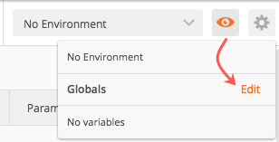

1.  You will need to set up the following variables. You can chose the `Bulk Edit` option and provide the text snippet below with your environment-specific values.

    ```text
    apic-host:<your api host>
    apic-org:<your org name>
    apic-catalog:<your catalog name>
    blueid-auth-url:https://prepiam.toronto.ca.ibm.com/idaas/oidc/endpoint/default/authorize
    blueid-token-url:https://prepiam.toronto.ca.ibm.com/idaas/oidc/endpoint/default/token
    client-id:<your client id>
    client-secret:<your client secret>
    ```

    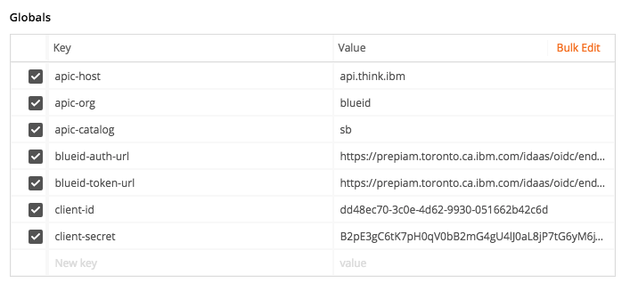

1.  If you send a test request now, you will receive an error code because no authentication token has been set.

1.  Open the `Logistics + OIDC` test request and click on the `Authorization` tab, followed by the `OAuth 2.0` option in the drop down menu.

    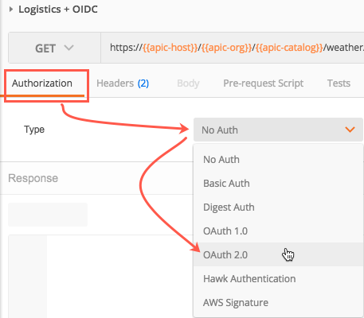

1.  Click the `Get New Access Token` button.

1.  Fill in the token request form:

    1.  Give the token a name, this will be used later as a selection option.

    1.  Use the Postman environment variable names inside of double curly braces to avoid having to re-copy and re-paste all of the values.

    1.  Set the scope to `openid`.

    1.  Click on the `Request Token` button.

    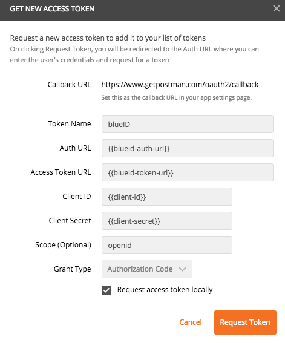

1.  In this demo, I am using the Authorization Code (3-Legged OAuth Grant Type) flow. A pop-up window will ask to enter your IBMid and Password.

    **Note:** When setting up the blueID client, we selected the Pre-Production identity provider. If you do not have an email account in the Pre-Production system, use the Create an IBMid link to set up an account before trying to log in.

1.  Once you sign-in, Postman will automatically save the token for use in your API calls.

1.  Select the `blueID` token from the Existing Tokens section, thecn click on the Use Token button to add it to the request headers.

    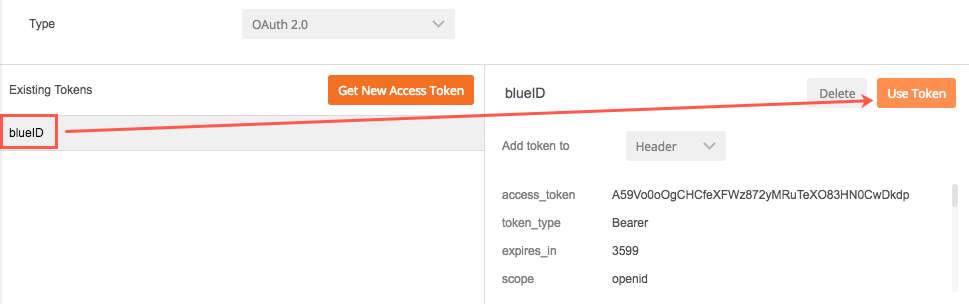

1.  You’re now ready to call the API hosted on the IBM API Connect platform. Click the Send Request button and view the response.

    **Note:** The API Gateway is configured with the IBM blueID Introspection URL. When a request is made to the secure API, the gateway will extract the token from the request headers and validate it with the blueID system.
